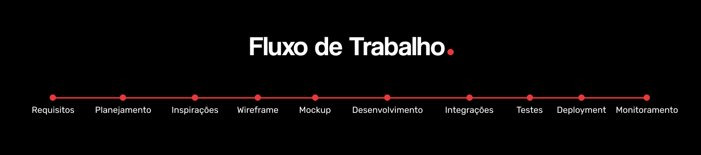
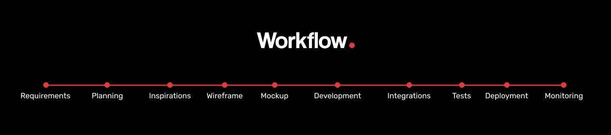

  

### Idioma | Language :
- [Português](#código-certo---landing-page)
- [English](#contatos)
  

 

# Código Certo - Landing Page
Como primeiro projeto, nossa equipe está encarregada de desenvolver uma landing page para a comunidade, com o objetivo de atrair novos voluntários.

Estamos focados em criar uma página envolvente e informativa que não apenas destaque as oportunidades de voluntariado, mas também reflita o espírito e os valores da nossa comunidade.

## Tecnologias:

## Sobre a equipe:
Nossa equipe está bastante engajada e comprometida em entregar projetos de extrema qualidade, que possam agregar valor a todos os membros da comunidade.

#### Nossos Objetivos:
- Desenvolver soluções criativas e eficientes
- Sermos reconhecidos por nossa dedicação e responsabilidade
- Transformar adversidades em oportunidades de aprendizado.

#### Nossos Valores:
- Aprendizado Contínuo
- Cooperação
- Criatividade

 

|      Raul Albuquerque         |       Alef Adonais        |      Deyweson Almeida        |   
|:-------------------------:|:-------------------------:|:-------------------------:|
|   |   |   |
| Líder da Equipe | Desenvolvedor Front-End | Desenvolvedor Back-End |
|   |   |   |

|      Emerson Bezerra        |     Iarlei Souza          |      John Sant Anna         |   
|:-------------------------:|:-------------------------:|:-------------------------:|
|   |   |   |
| Desenvolvedor Back-End | Desenvolvedor Front-End | Desenvolvedor Back-End |
   |   |   |

|      Jullia Fernandes         |      Lucas Souza        |      Luís Gustavo         |   
|:-------------------------:|:-------------------------:|:-------------------------:|
|   |   |   |
| Desenvolvedora Back-End | Desenvolvedor Front-End | QA |
|   |   |   |

|      Manoela Coelho        |      Pedro Barreto         |      Rafael Lima          |   
|:-------------------------:|:-------------------------:|:-------------------------:|
|   |   |   |
| Desenvolvedora Front-End | Desenvolvedor Front-End| Desenvolvedor Front-End |
|   |   |   |

## Fluxo de Trabalho:

## Tutoriais:
#### Módulo 1 - Git:
 - [Comandos Básicos no Terminal](https://imminent-politician-8bc.notion.site/Comandos-B-sicos-no-Terminal-bf944666fda544d387180d5a0d299f2f)
 - [Trabalhando com Branches](https://www.notion.so/Git-Github-Equipe-04-c59c81b156ed45c9a0b4e12beb0dad80?p=28734cec67eb44f6b2a23d7cd90cf195&pm=c)
 - [Comandos do Git](https://www.notion.so/Git-Github-Equipe-04-c59c81b156ed45c9a0b4e12beb0dad80?p=8d4d727aeec74713bcc2ebc795656442&pm=c)

 #### Módulo 2 - Github:
 - [Conhecendo o Github](https://www.notion.so/Git-Github-Equipe-04-c59c81b156ed45c9a0b4e12beb0dad80?p=16ea639d369345aaade39161d9830623&pm=c)
 - [Como Contribuir no projeto](https://www.notion.so/Git-Github-Equipe-04-c59c81b156ed45c9a0b4e12beb0dad80?p=d1821d6fca39478cb2b45a93206168ee&pm=c)

## Contatos:

   

 

# Código Certo - Landing Page - EN
As our first project, our team is tasked with developing a landing page for the community, aimed at attracting new volunteers.

We are focused on creating an engaging and informative page that not only highlights volunteering opportunities but also reflects the spirit and values of our community.

## Techs:

## About:
Our team is highly engaged and committed to delivering projects of exceptional quality that add value to all community members.

#### Our Goals:
- Develop creative and efficient solutions
- Be recognized for our dedication and responsibility
- Turn challenges into learning opportunities

#### Our Values:
- Continuous Learning
- Cooperation
- Creativity

 

|      Raul Albuquerque         |       Alef Adonais        |      Deyweson Almeida        |   
|:-------------------------:|:-------------------------:|:-------------------------:|
|   |   |   |
| Team Leader | Front-End Developer | Back-End Developer |
|   |   |   |

|      Emerson Bezerra        |     Iarlei Souza          |      John Sant Anna         |   
|:-------------------------:|:-------------------------:|:-------------------------:|
|   |   |   |
| Back-End Developer| Front-End Developer | Back-End Developer |
   |   |   |

|      Jullia Fernandes         |      Lucas Souza        |      Luís Gustavo         |   
|:-------------------------:|:-------------------------:|:-------------------------:|
|   |   |   |
| Back-End Developer | Front-End Developer | QA |
|   |   |   |

|      Manoela Coelho        |      Pedro Barreto         |      Rafael Lima          |   
|:-------------------------:|:-------------------------:|:-------------------------:|
|   |   |   |
| Front-End Developer | Front-End Developer | Front-End Developer |
|   |   |   |

## Workflow:

## Tutorials:
#### First Module - Git:
 - [Terminal - Basic Commands](https://imminent-politician-8bc.notion.site/Comandos-B-sicos-no-Terminal-bf944666fda544d387180d5a0d299f2f)
 - [Working with Branches](https://www.notion.so/Git-Github-Equipe-04-c59c81b156ed45c9a0b4e12beb0dad80?p=28734cec67eb44f6b2a23d7cd90cf195&pm=c)
 - [Git commands](https://www.notion.so/Git-Github-Equipe-04-c59c81b156ed45c9a0b4e12beb0dad80?p=8d4d727aeec74713bcc2ebc795656442&pm=c)

 #### Second Module - Github:
 - [Getting to Know GitHub](https://www.notion.so/Git-Github-Equipe-04-c59c81b156ed45c9a0b4e12beb0dad80?p=16ea639d369345aaade39161d9830623&pm=c)
 - [How to contribute](https://www.notion.so/Git-Github-Equipe-04-c59c81b156ed45c9a0b4e12beb0dad80?p=d1821d6fca39478cb2b45a93206168ee&pm=c)

## Contacts:

