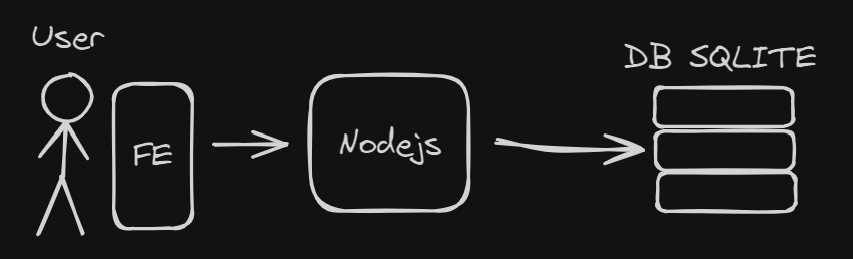
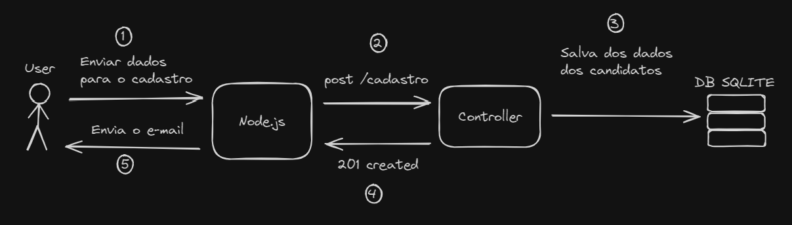
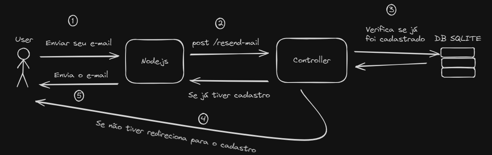

# Back-End Código Certo

API para cadastro de novos participantes da plataforma/comunidade Código Certo, o usuários podem se cadastrar para poder receber novidades e informes: 

Projeto desenvolvido com intuito de automatizar o registro e envio de email para os participantes
## Índice

- [Arquitetura](#arquitetura)
- [Funcionalidades](#funcionalidades)
- [Instruções de execução](#instruções-de-execução)
- [Contribua com o projeto](#contribua-com-o-projeto)

## Arquitetura

**Node.js / JavaScript**
**SQLite**



## Funcionalidades

### 1. Cadastro do participante e envio do e-mail



### 2. Reenvio do e-mail para o participante


## Instruções de execução

Este guia fornece instruções detalhadas para configurar e executar o projeto, incluindo a definição de porta, configuração do banco de dados e configuração do serviço de e-mail.

### Passo 1: Definindo a Porta do Servidor

Para configurar a porta em que o servidor irá rodar, defina a variável de ambiente `PORT`. 
O valor padrão é 3000, mas você pode alterá-lo conforme necessário:

PORT=3000

### 2. Configurando o Banco de Dados

Para configurar o banco de dados, defina a URL de conexão na variável `DATABASE_URL`:

```env
DATABASE_URL="file:./dev.db"
```

Se desejar utilizar outro banco de dados, substitua a string de conexão e altere o `provider` no arquivo `./prisma/schema.prisma` para o banco desejado:

``` prisma
datasource db {   
	provider = "SEU_BANCO_AQUI"   
	url      = env("DATABASE_URL") 
}
```


### 3. Configuração de E-mail para Envio

Para configurar o serviço de email, defina as seguintes variáveis de ambiente:

```env
EMAILSERVICE=nome_do_serviço_de_email 
EMAILHOST= host_do_provedor_de_email 
EMAILPORT= 587  
EMAILUSER= seu_email 
EMAILPASS= sua_senha_de_aplicativo
```

> **Nota:** Para gerar uma senha de aplicativo no Gmail, siga os passos deste [link](https://support.google.com/accounts/answer/185833?hl=pt-BR).

## Contribua com o Projeto

Você pode contribuir com o projeto de duas maneiras:

1. **Relatar um Bug/Erro:** Abra uma *issue* para relatar qualquer bug ou erro que você encontrar.
2. **Melhorias e Correções:** Faça um *fork* do repositório, implemente suas melhorias ou correções de bugs, e envie um *Pull Request* (PR) para revisão.

Sua contribuição é muito importante para o desenvolvimento contínuo do projeto!
