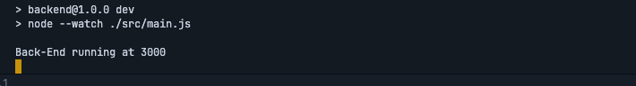

## Guia para configuração do banco de dados

### ORM:
- [Prisma](https://www.prisma.io/)

### Banco de Dados:
- [SQLite](https://www.sqlite.org/)

### Etapas:

1. **Defina a URL de conexão na variável `DATABASE_URL`:**

    ```env
    DATABASE_URL="file:./dev.db"
    ```

2. **Para utilizar outro banco de dados, substitua a string de conexão e altere o `provider` no arquivo `./prisma/schema.prisma` para o banco desejado:**

    ``` prisma
    datasource db {   
      provider = "SEU_BANCO_AQUI"   
      url      = env("DATABASE_URL") 
    }
    ```

3. **Navegue até a pasta do backend**
    ```
    cd backend
    ```

4. **Instale as dependências:**
    ```env
    npm install
    ``` 

5. **Defina as variáveis de ambiente:**
    ```env
    EMAILSERVICE=nome_do_serviço_de_email 
    EMAILHOST= host_do_provedor_de_email 
    EMAILPORT= 587  
    EMAILUSER= seu_email 
    EMAILPASS= sua_senha_de_aplicativo
    ```

6. **Realize as migrações:**
    ```env
    npx prisma migrate deploy
    ```

7. **Gere o cliente Prisma:**
    ```env
    npx prisma generate
    ```

8. **Inicie o servidor:**
    ```env
    npm run dev
    ```

9. **A seguinte mensagem será exibida no terminal:**

    

