## Guia para realizar o deploy do Back-End

### Plataforma:

- [Railway](https://railway.app/)

### Etapas:

1. **Acesse o seu dashboard:**

   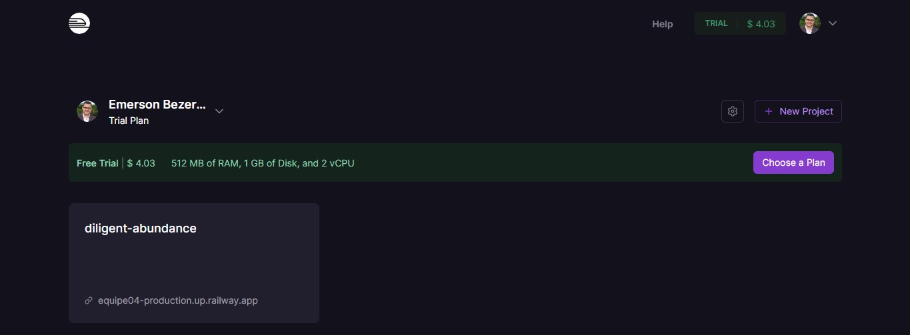

2. **Clique em "New Project" :**

   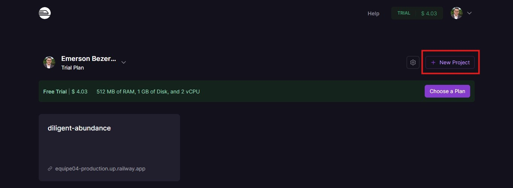

3. **Clique em "Deploy from GitHub repo" :**

   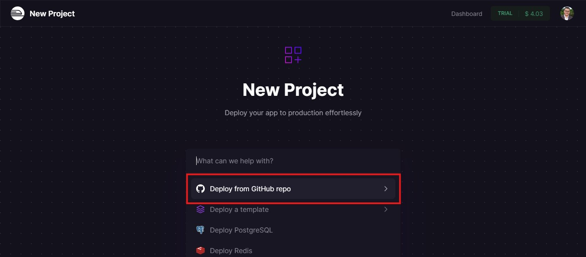

4. **Escolha o projeto e clique sobre ele:**

   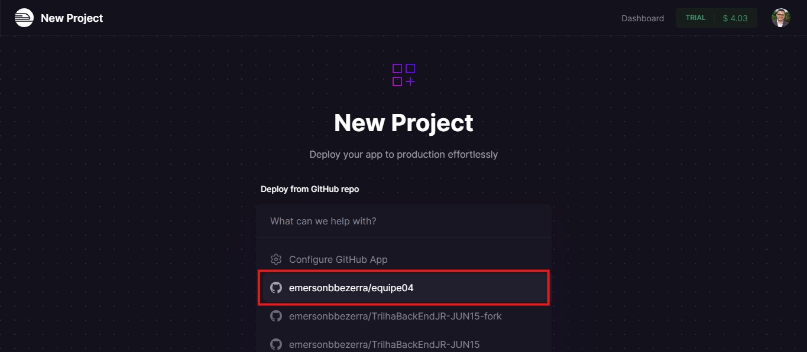

5. **Clique em "Add variables" :**

   

6. **Clique em "Raw Editor" :**

   

7. **Preencha com as variáveis de ambiente e clique em "Update Variables" :**

   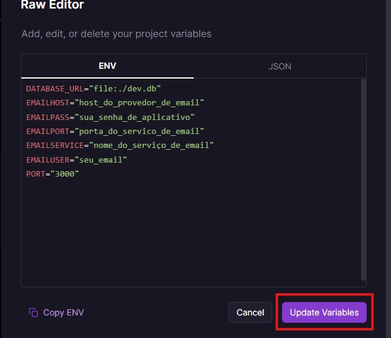

8. **Clique em "Settings" :**

   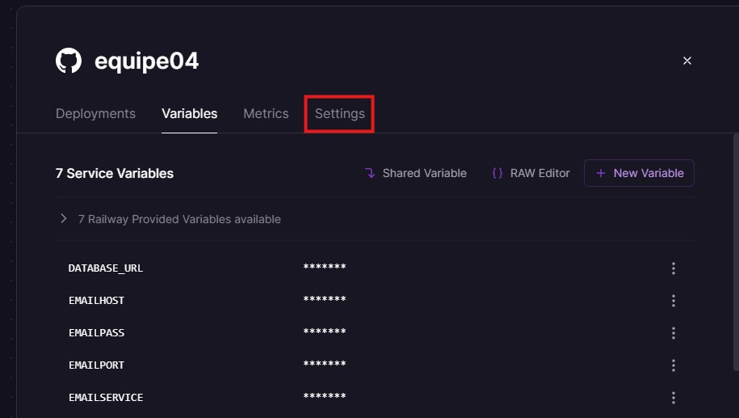

9. **Nessa tela abaixo configure os campos a seguir:**

   

10. **Indique a pasta onde está localizado o backend.**

    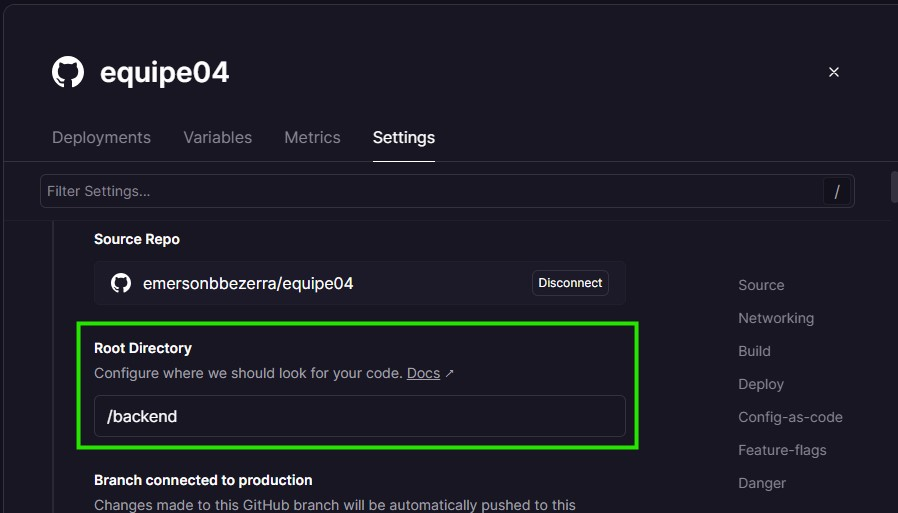

11. **indique a branch correta para o deploy.**

    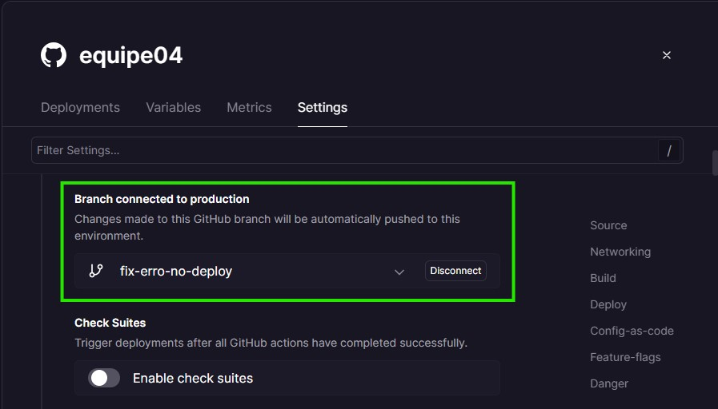

12. **Clique em "Generate Domain" :**

    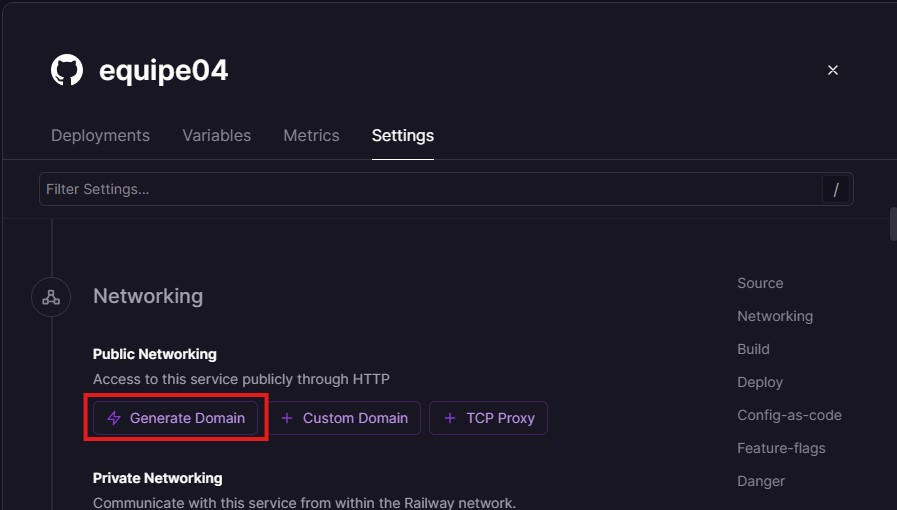

13. **Clique em "Disable private networking" :**

    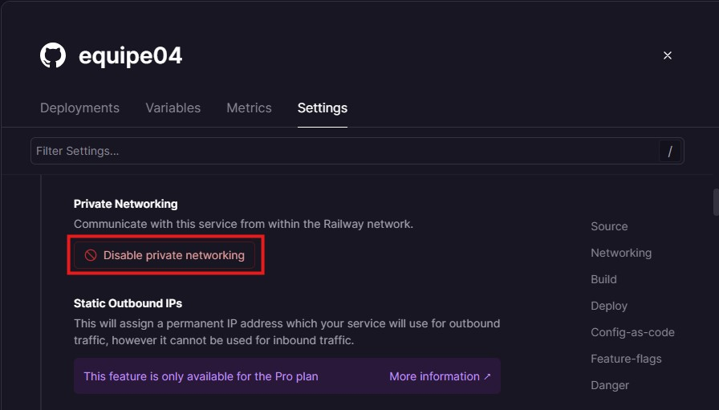

14. **Habilite a opção "Enable new builder" :**

    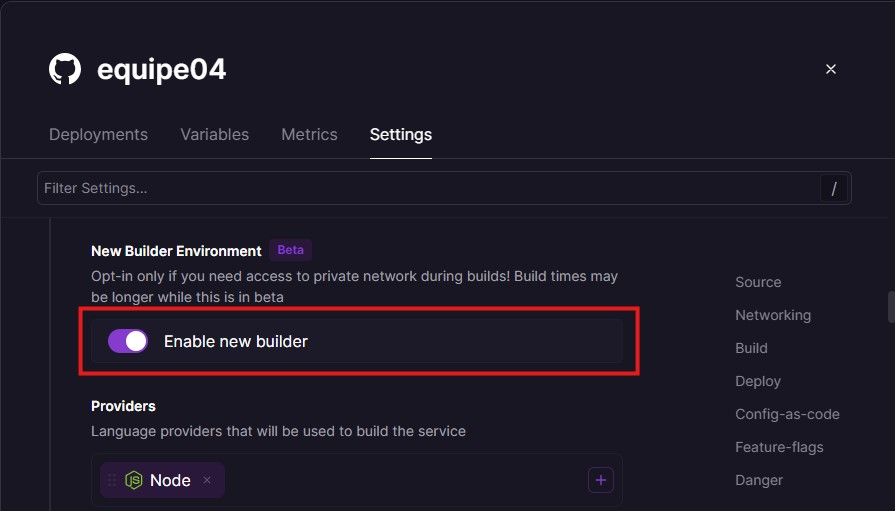

15. **Clique em "Build Command" e acrescente os comandos de build abaixo:**

    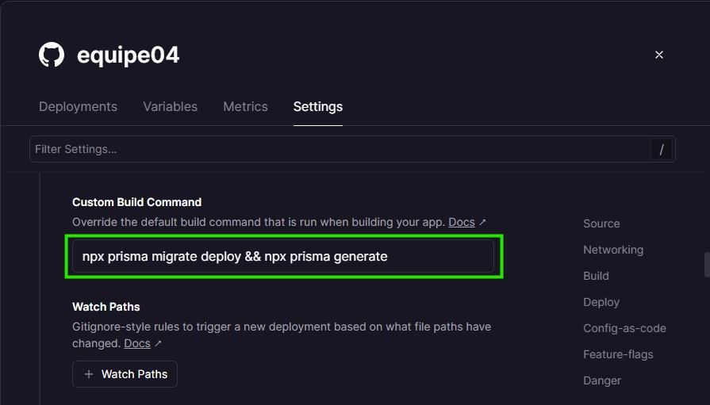

16. **Clique em "Start Command" e acrescente os comandos de deploy abaixo:**

    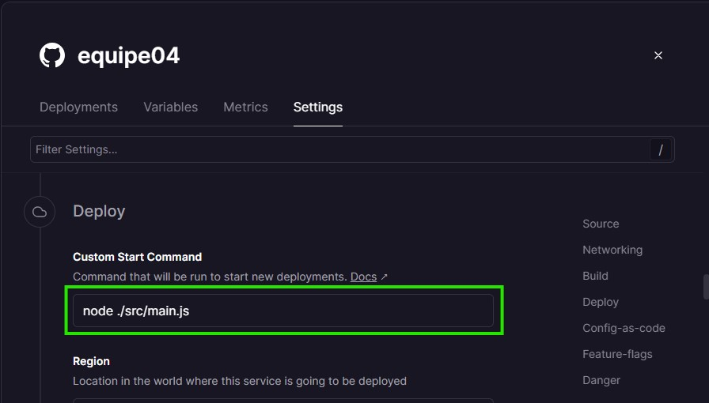

17. **Clique em "Deploy" e aguarde a conclusão do processo.**

    

### Deploy realizado com sucesso!🎉
