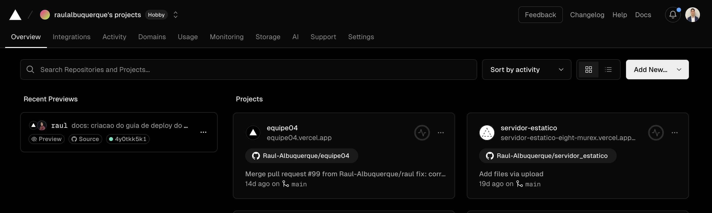
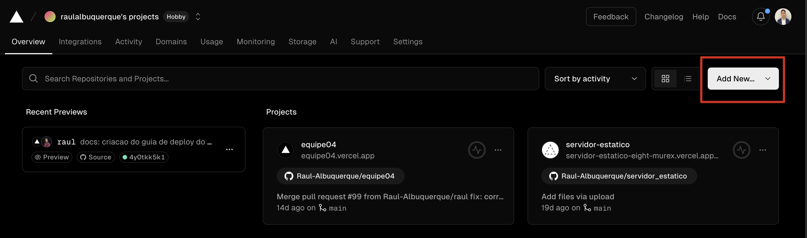
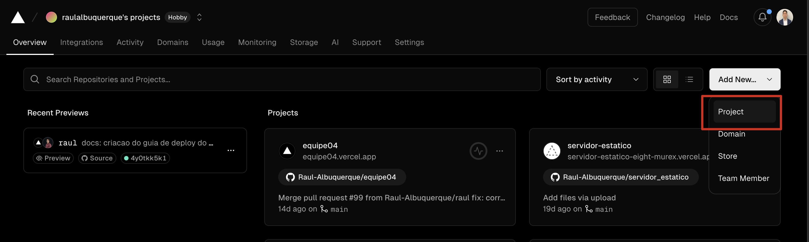
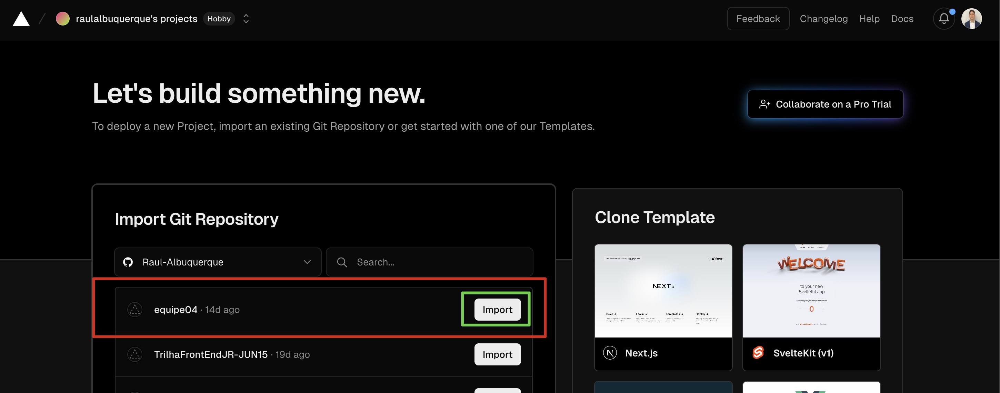
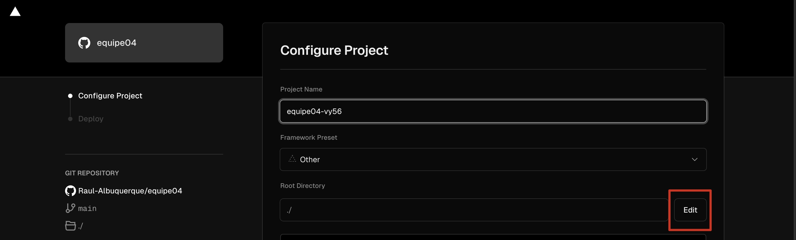
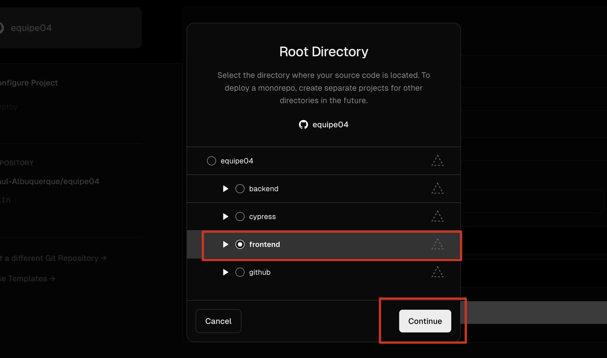
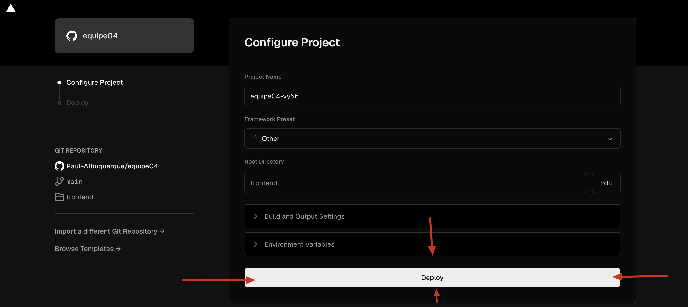
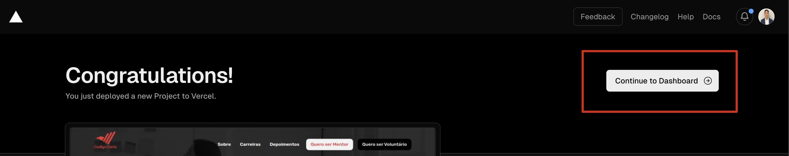
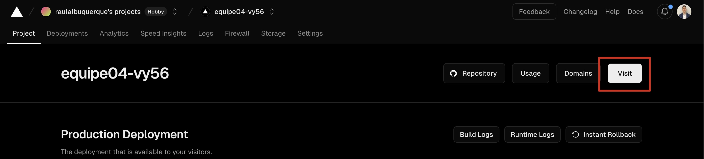

## Guia para realizar o deploy do Front-End

### Plataforma:
- [Vercel](https://vercel.com/)

### Etapas:

1. **Acesse o seu painel de projetos:**

    

2. **Clique em "Add New..." :**

    

3. **Clique em "Project" :**

    

4. **Escolha o projeto e clique em "Import" :**

    

5. **Em Root Directory clique em "Edit" :**

    

6. **Selecione "frontend" e clique em "Continue" :**

    

7. **Clique em "Deploy" :**

    

8. **Clique em "Continue to Dashboard" :**

    

9. **Clique em "Visit" para acessar o seu projeto :**

    

### Deploy realizado com sucesso!🎉
